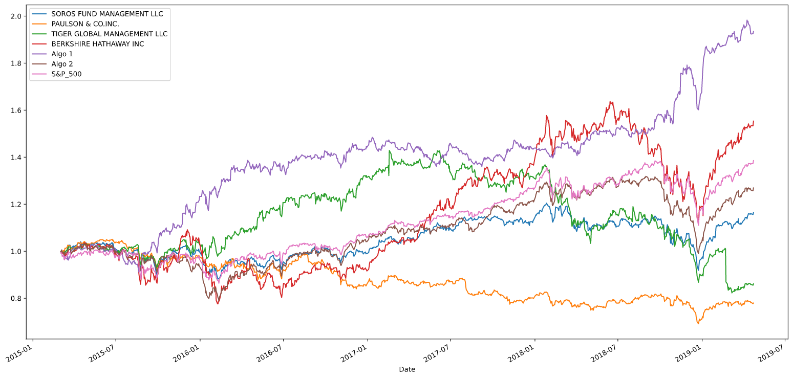
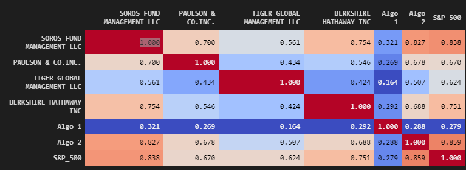
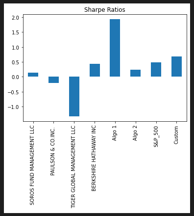

# quant_stats_portfolio

## Table of Contents

* General Information
     * Quant analysis to base portfolio
     * Quant analysis to custom portfolio
     * Comparison of custom portfolio vs base portfolio

* Libraries
* Folder structure

## Quant Analysis to base portfolio

* The goal of this analysis was to compare the performance of two Algo strategies with 5 funds from the Whale portfolio and the S&P 500.

* With the analysis of the cumulative returns, it transpires that the Algo 1 outperformed the S&P 500 while Algo 2 underperformed the S&P 500. Also, it was noticed that the Berkshire portfolio, not only second the performance, it actually exceeded the performance of all the compared funds for 12 months of 2018-2019. 

* Further analysis on risk demonstrated that both Algos had lower standard deviation than S&P 500, therefore, represents less risk. And a correlation analysis, also indicates that the least correlated of all the compared portfolios was Algo1. 

* Due to the fact that Algo 1 represents less risk, it is least correlated (blue color),combined with better returns, it was concluded that Algo 1 was a better insvestment strategy among all the portfolios.

## Quant Analysis to custom portfolio

* Finally, a new custom portfolio composed of equaly weighted stocks (cat, gld, jpm, msft, sbux, wmt) was assesed against the previous portfolios (whales, Algo1 & Algo2), and although it outperformed the S&P 500 in terms of sharpe ratio, it felt short compared to the Algo 1.

## Libraries

* To complete these analysis, the following libraries were used: pandas, numpy, datetime,pathlib and os. 
* for the visualization and charting, seaborn and maptplotlib were used.

## Folder Structure

The project consists of 1 main folder and 3 sub-folders: the main folder holds README.md and jupyterLab notebook (whale_analysis.ipynb). The three other folders are: images (to hold snapshots of the charts), Resources and Resourcesb (which hold native csv files for the portfolio analysis and custom portfolio comparable, respectively).

